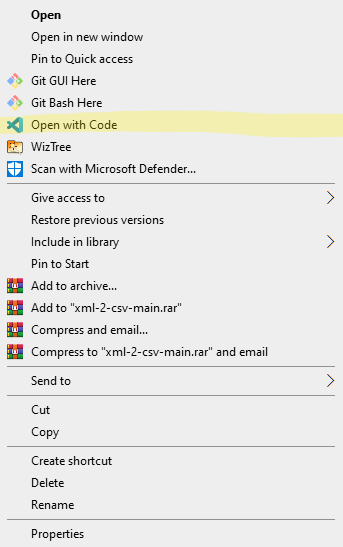
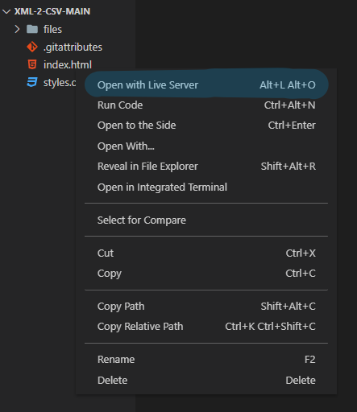
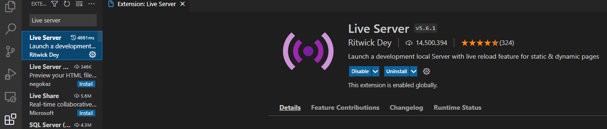
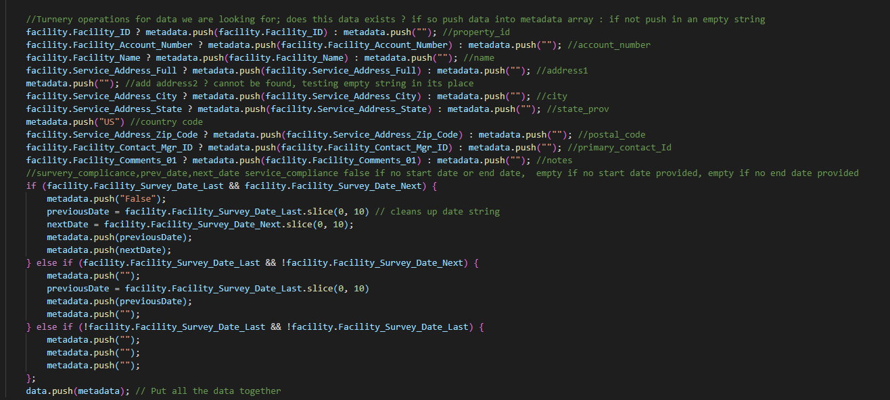

Thank you for using xml-2-csv by Gary Rios.
This script uses txml as a parser.

Steps to use:

1. Right click the Downloaded folder and select Open with Code.

2. Once VScode has opened the folder, right click index.html and select open with Live Server. If Live Server if not an option, continue to step 3.

3. In the extensions tab type "Live Server" into the search bar and select install, restart VScode and follow with step 3.

**How it works under the hood:**

Once we're parsed our data we check if certain fields exist in the xml file and if it does not then we pass in an empty string.
